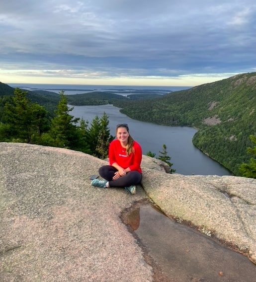

# Welcome to my website!

Hi! My name is Catherine Mauro, and I am a Master of Public Health Candidate at
Columbia University's *Mailman School of Public Health*. My degree will be in 
Epidemiology, with a certificate in Applied Biostatistics and Public Health Data
Science. You can learn more about my work experience on my [resume page](resume.html),
or feel free to browse links to my social media accounts in the header. 

**.................................................................................................**
**.................................................................................................**
**.................................................................................................**
**.................................................................................................**

  When I am not studying or working on a data analysis project, I love visiting
  national parks, hiking, baking, and obsessing over my dog, (Nervous) Nellie :)

